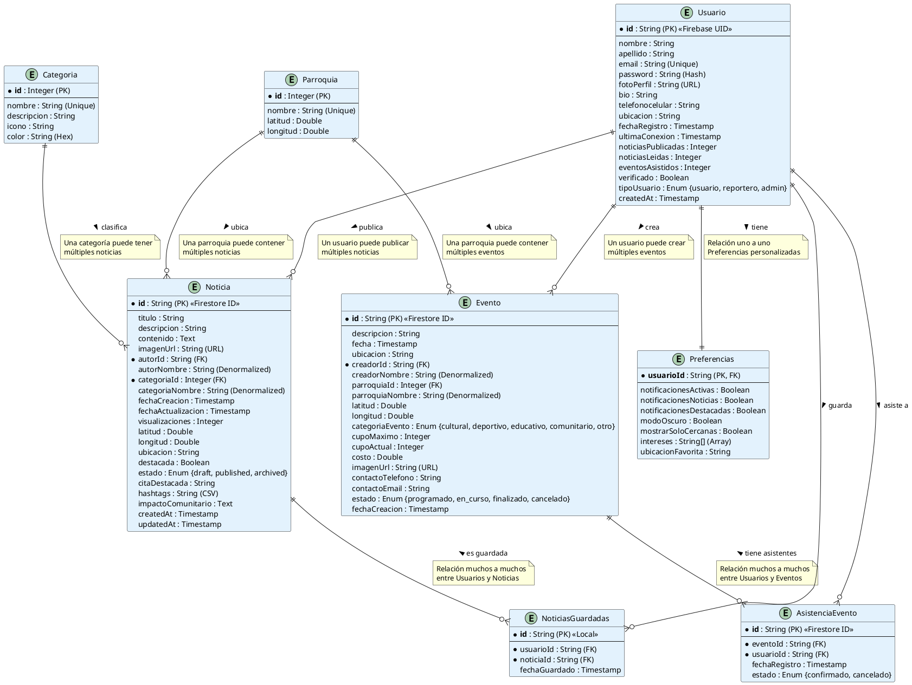

# Diagrama Entidad-Relación - GeoNews

## Descripción
Este diagrama representa el modelo de datos de GeoNews almacenado en Firebase Firestore, mostrando las entidades, sus atributos y las relaciones entre ellas.

---

## Diagrama ER (Notación Chen / Crow's Foot)



---

## Modelo de Datos Firestore

### Colecciones Principales

#### 1. **Colección: `usuarios`**
```json
{
  "id": "firebase_uid_123",
  "nombre": "Juan",
  "apellido": "Pérez",
  "email": "juan.perez@example.com",
  "fotoPerfil": "https://storage.googleapis.com/...",
  "bio": "Reportero local de Ibarra",
  "ubicacion": "Ibarra Centro",
  "fechaRegistro": 1704067200000,
  "tipoUsuario": "reportero",
  "verificado": true,
  "noticiasPublicadas": 15,
  "noticiasLeidas": 234,
  "eventosAsistidos": 8
}
```

#### 2. **Colección: `noticias`**
```json
{
  "id": "noticia_001",
  "titulo": "Nueva ciclovía en Ibarra Centro",
  "descripcion": "Inauguración de 2km de ciclovía",
  "contenido": "La alcaldía de Ibarra inauguró hoy...",
  "imagenUrl": "https://storage.googleapis.com/...",
  "autorId": "firebase_uid_123",
  "autorNombre": "Juan Pérez",
  "categoriaId": 8,
  "categoriaNombre": "Medio Ambiente",
  "fechaCreacion": 1704153600000,
  "visualizaciones": 345,
  "latitud": 0.3514,
  "longitud": -78.1267,
  "ubicacion": "Ibarra Centro",
  "destacada": true,
  "estado": "published",
  "citaDestacada": "Esta obra beneficia a 5000 ciclistas",
  "hashtags": "#Ibarra #Ciclovía #MedioAmbiente",
  "impactoComunitario": "Reducción de 20% en emisiones de CO2"
}
```

#### 3. **Colección: `eventos`**
```json
{
  "id": "evento_001",
  "descripcion": "Feria Gastronómica de Ibarra",
  "fecha": 1706745600000,
  "ubicacion": "Parque Pedro Moncayo",
  "creadorId": "firebase_uid_456",
  "creadorNombre": "María González",
  "parroquiaId": 1,
  "parroquiaNombre": "Ibarra Centro",
  "latitud": 0.3476,
  "longitud": -78.1227,
  "categoriaEvento": "cultural",
  "cupoMaximo": 500,
  "cupoActual": 234,
  "costo": 0.0,
  "imagenUrl": "https://storage.googleapis.com/...",
  "contactoEmail": "feria@ibarra.gob.ec",
  "contactoTelefono": "062-123-456",
  "estado": "programado"
}
```

#### 4. **Colección: `categorias`**
```json
{
  "id": 1,
  "nombre": "Política",
  "descripcion": "Noticias políticas locales",
  "icono": "ic_politics",
  "color": "#FF6B35"
}
```

#### 5. **Colección: `parroquias`**
```json
{
  "id": 1,
  "nombre": "Ibarra Centro",
  "latitud": 0.3514,
  "longitud": -78.1267
}
```

#### 6. **Colección: `asistencias_eventos`**
```json
{
  "id": "asist_001",
  "eventoId": "evento_001",
  "usuarioId": "firebase_uid_123",
  "fechaRegistro": 1704240000000,
  "estado": "confirmado"
}
```

---

## Estructura de Almacenamiento

### Firebase Firestore (Base de Datos NoSQL)
```
/usuarios
  /{userId}
    - documento con datos del usuario

/noticias
  /{noticiaId}
    - documento con datos de la noticia

/eventos
  /{eventoId}
    - documento con datos del evento

/categorias
  /{categoriaId}
    - documento con datos de la categoría

/parroquias
  /{parroquiaId}
    - documento con datos de la parroquia

/asistencias_eventos
  /{asistenciaId}
    - documento de relación usuario-evento

/noticias_guardadas (Local - SharedPreferences)
  - Lista de IDs de noticias guardadas por usuario

/preferencias (Local - EncryptedSharedPreferences)
  - Configuraciones del usuario
```

### Firebase Storage (Archivos)
```
/usuarios
  /fotos_perfil
    /profile_{userId}_{timestamp}.jpg

/noticias
  /imagenes
    /noticia_{noticiaId}_{timestamp}.jpg

/eventos
  /imagenes
    /evento_{eventoId}_{timestamp}.jpg
```

---

## Índices de Firestore

### Índices Compuestos Necesarios

1. **Noticias por categoría y fecha**
   - Campos: `categoriaId` (ASC), `fechaCreacion` (DESC)

2. **Noticias destacadas publicadas**
   - Campos: `destacada` (ASC), `estado` (ASC), `fechaCreacion` (DESC)

3. **Eventos futuros por categoría**
   - Campos: `categoriaEvento` (ASC), `fecha` (ASC), `estado` (ASC)

4. **Asistencias por usuario**
   - Campos: `usuarioId` (ASC), `fechaRegistro` (DESC)

### Índices de Geolocalización (GeoFirestore)

Para búsquedas por proximidad:
- Noticias: Campo `geohash` basado en `latitud` y `longitud`
- Eventos: Campo `geohash` basado en `latitud` y `longitud`

---

## Reglas de Integridad

1. **Unicidad**
   - `usuarios.email` debe ser único
   - `categorias.nombre` debe ser único
   - `parroquias.nombre` debe ser único

2. **Obligatoriedad (NOT NULL)**
   - Todos los campos marcados con `*` son obligatorios

3. **Valores por Defecto**
   - `noticia.visualizaciones` = 0
   - `noticia.destacada` = false
   - `noticia.estado` = "draft"
   - `evento.cupoActual` = 0
   - `evento.estado` = "programado"
   - `usuario.verificado` = false
   - `usuario.tipoUsuario` = "usuario"

4. **Restricciones de Dominio**
   - `usuario.tipoUsuario` ∈ {usuario, reportero, admin}
   - `noticia.estado` ∈ {draft, published, archived}
   - `evento.estado` ∈ {programado, en_curso, finalizado, cancelado}
   - `evento.categoriaEvento` ∈ {cultural, deportivo, educativo, comunitario, otro}
   - `evento.cupoActual` ≤ `evento.cupoMaximo`

5. **Desnormalización Controlada**
   - `autorNombre` en Noticia (reduce lecturas)
   - `categoriaNombre` en Noticia (reduce lecturas)
   - `creadorNombre` en Evento (reduce lecturas)
   - `parroquiaNombre` en Evento (reduce lecturas)

---

## Cardinalidades

| Relación | Cardinalidad | Descripción |
|----------|--------------|-------------|
| Usuario → Noticia | 1:N | Un usuario publica muchas noticias |
| Usuario → Evento | 1:N | Un usuario crea muchos eventos |
| Categoria → Noticia | 1:N | Una categoría tiene muchas noticias |
| Parroquia → Noticia | 1:N | Una parroquia contiene muchas noticias |
| Parroquia → Evento | 1:N | Una parroquia contiene muchos eventos |
| Usuario ↔ Evento | N:M | Muchos usuarios asisten a muchos eventos |
| Usuario ↔ Noticia Guardada | N:M | Muchos usuarios guardan muchas noticias |
| Usuario → Preferencias | 1:1 | Un usuario tiene una configuración |

---

**Proyecto**: GeoNews - Noticias Locales de Ibarra
**Versión**: 0.1.0
**Base de Datos**: Firebase Firestore (NoSQL)
**Fecha**: Enero 2026
