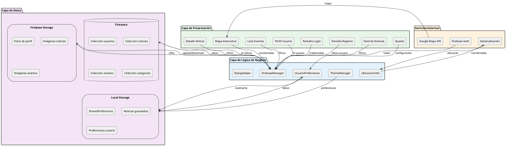

# Diseño de Entrada y Salida - GeoNews

## Descripción
Este documento describe las interfaces de usuario, formatos de entrada/salida de datos y los flujos de información del sistema GeoNews.

---

## 1. Arquitectura del Sistema



---

## 2. Diseño de Interfaces (Entrada)

### 2.1. Pantalla de Login

**Entrada de Datos:**
```
┌─────────────────────────────────────┐
│          GEONEWS - LOGIN            │
├─────────────────────────────────────┤
│                                     │
│  Logo GeoNews                       │
│                                     │
│  ┌───────────────────────────────┐ │
│  │ Email                         │ │
│  └───────────────────────────────┘ │
│                                     │
│  ┌───────────────────────────────┐ │
│  │ Contraseña           [👁]     │ │
│  └───────────────────────────────┘ │
│                                     │
│  [ ] Recordar sesión               │
│                                     │
│  ┌───────────────────────────────┐ │
│  │     INICIAR SESIÓN            │ │
│  └───────────────────────────────┘ │
│                                     │
│  ¿Olvidaste tu contraseña?         │
│                                     │
│  ─────────── o ───────────         │
│                                     │
│  [G] Iniciar con Google            │
│                                     │
│  ¿No tienes cuenta? Regístrate     │
│                                     │
└─────────────────────────────────────┘
```

**Formato de Entrada:**
- Email: String (formato email válido)
- Contraseña: String (mínimo 6 caracteres)

**Validaciones:**
- Email no vacío y formato válido
- Contraseña no vacía
- Verificación con Firebase Auth

**Salida:**
- Éxito: Navegación a ListaNoticiasActivity + Token de sesión
- Error: Toast con mensaje de error

---

### 2.2. Pantalla de Registro

**Entrada de Datos:**
```
┌─────────────────────────────────────┐
│       CREAR CUENTA - GEONEWS        │
├─────────────────────────────────────┤
│                                     │
│  [📷] Foto de perfil (opcional)     │
│                                     │
│  ┌───────────────────────────────┐ │
│  │ Nombre                        │ │
│  └───────────────────────────────┘ │
│                                     │
│  ┌───────────────────────────────┐ │
│  │ Apellido                      │ │
│  └───────────────────────────────┘ │
│                                     │
│  ┌───────────────────────────────┐ │
│  │ Email                         │ │
│  └───────────────────────────────┘ │
│                                     │
│  ┌───────────────────────────────┐ │
│  │ Contraseña           [👁]     │ │
│  └───────────────────────────────┘ │
│                                     │
│  ┌───────────────────────────────┐ │
│  │ Confirmar Contraseña [👁]     │ │
│  └───────────────────────────────┘ │
│                                     │
│  [✓] Acepto términos y condiciones │
│                                     │
│  ┌───────────────────────────────┐ │
│  │       REGISTRARSE             │ │
│  └───────────────────────────────┘ │
│                                     │
│  ¿Ya tienes cuenta? Inicia sesión  │
│                                     │
└─────────────────────────────────────┘
```

**Formato de Entrada:**
```json
{
  "nombre": "String (1-50 caracteres)",
  "apellido": "String (1-50 caracteres)",
  "email": "String (formato email)",
  "password": "String (6-20 caracteres)",
  "fotoPerfil": "File (JPG/PNG, max 5MB) - opcional"
}
```

**Salida:**
```json
{
  "success": true,
  "userId": "firebase_uid_123",
  "token": "eyJhbGciOiJSUzI1NiIsImtpZCI6...",
  "message": "Cuenta creada exitosamente"
}
```

---

### 2.3. Feed de Noticias

**Entrada de Datos:**
```
┌─────────────────────────────────────┐
│  NOTICIAS                      [🔍] │
├─────────────────────────────────────┤
│                                     │
│  ┌─┬─┬─┬─┬─┬─┬─┬─┬─┬─┬─┬─┬─┬─┐    │
│  │Todas│Cercanas│Destacadas│ [+] │  │
│  └─┴─┴─┴─┴─┴─┴─┴─┴─┴─┴─┴─┴─┴─┘    │
│                                     │
│  ┌─────────────────────────────┐   │
│  │ [IMG]                       │   │
│  │                             │   │
│  │ Nueva ciclovía en Ibarra    │   │
│  │ 2 km inaugurados hoy        │   │
│  │                             │   │
│  │ 🏷️ Medio Ambiente  📍 2.3km  │   │
│  │ ⭐ Juan Pérez • 2h          │   │
│  │                             │   │
│  │ [❤️ 234]  [💬 45]  [🔗]  [⭐] │   │
│  └─────────────────────────────┘   │
│                                     │
│  ┌─────────────────────────────┐   │
│  │ [IMG]                       │   │
│  │ Feria gastronómica...       │   │
│  │ ...                         │   │
│  └─────────────────────────────┘   │
│                                     │
├─────────────────────────────────────┤
│ [📰] [📅] [🗺️] [👤]               │
└─────────────────────────────────────┘
```

**Filtros de Entrada:**
- Tipo: Todas / Cercanas / Destacadas
- Categoría: Política, Economía, Cultura, etc.
- Ubicación: Coordenadas GPS (lat, lon)
- Radio: 5km, 10km, 20km

**Formato de Salida:**
```json
[
  {
    "id": "noticia_001",
    "titulo": "Nueva ciclovía en Ibarra",
    "descripcion": "2 km inaugurados hoy",
    "imagenUrl": "https://...",
    "categoriaNombre": "Medio Ambiente",
    "distancia": 2.3,
    "autorNombre": "Juan Pérez",
    "fechaCreacion": 1704153600000,
    "visualizaciones": 234,
    "guardada": false
  }
]
```

---

### 2.4. Detalle de Noticia

**Entrada:**
- ID de noticia (String)

**Interfaz de Salida:**
```
┌─────────────────────────────────────┐
│  [←]  Noticia           [⋮] [⭐]    │
├─────────────────────────────────────┤
│                                     │
│  ┌─────────────────────────────┐   │
│  │                             │   │
│  │     [IMAGEN PRINCIPAL]      │   │
│  │                             │   │
│  └─────────────────────────────┘   │
│                                     │
│  🏷️ Medio Ambiente                 │
│                                     │
│  Nueva ciclovía en Ibarra Centro   │
│  ══════════════════════════════    │
│                                     │
│  ✍️ Por Juan Pérez                 │
│  📅 Hace 2 horas                   │
│  📍 Ibarra Centro (2.3 km)         │
│  👁️ 234 visualizaciones            │
│                                     │
│  ──────────────────────────────    │
│                                     │
│  La alcaldía de Ibarra inauguró    │
│  hoy 2 kilómetros de nueva         │
│  ciclovía en el centro...          │
│                                     │
│  📌 CITA DESTACADA:                │
│  "Esta obra beneficia a 5000       │
│   ciclistas diariamente"           │
│                                     │
│  [Contenido completo...]           │
│                                     │
│  💬 IMPACTO COMUNITARIO:           │
│  Reducción de 20% en emisiones     │
│                                     │
│  #Ibarra #Ciclovía #MedioAmbiente  │
│                                     │
│  ──────────────────────────────    │
│                                     │
│  📍 [VER EN MAPA]                  │
│  📤 [COMPARTIR]                    │
│                                     │
└─────────────────────────────────────┘
```

**Formato de Salida:**
```json
{
  "id": "noticia_001",
  "titulo": "Nueva ciclovía en Ibarra Centro",
  "descripcion": "Breve descripción",
  "contenido": "Contenido completo HTML/Markdown",
  "imagenUrl": "https://storage.googleapis.com/...",
  "autorNombre": "Juan Pérez",
  "categoriaNombre": "Medio Ambiente",
  "fechaCreacion": 1704153600000,
  "visualizaciones": 234,
  "latitud": 0.3514,
  "longitud": -78.1267,
  "ubicacion": "Ibarra Centro",
  "citaDestacada": "Esta obra beneficia a 5000 ciclistas",
  "hashtags": "#Ibarra #Ciclovía #MedioAmbiente",
  "impactoComunitario": "Reducción de 20% en emisiones"
}
```

---

### 2.5. Mapa Interactivo

**Entrada de Datos:**
```
┌─────────────────────────────────────┐
│  MAPA                      [⚙️] [🔍] │
├─────────────────────────────────────┤
│                                     │
│  [✓] Noticias  [✓] Eventos         │
│                                     │
│  ╔═══════════════════════════════╗ │
│  ║                               ║ │
│  ║    📍 Marcador Noticia        ║ │
│  ║         (Verde)               ║ │
│  ║                               ║ │
│  ║    📍 Marcador Evento         ║ │
│  ║         (Naranja)             ║ │
│  ║                               ║ │
│  ║    [📍 Mi ubicación]          ║ │
│  ║                               ║ │
│  ║  ┌─────────────────────┐      ║ │
│  ║  │ Nueva ciclovía      │      ║ │
│  ║  │ 2.3 km • Ver detalles │    ║ │
│  ║  └─────────────────────┘      ║ │
│  ║                               ║ │
│  ╚═══════════════════════════════╝ │
│                                     │
│  [🎯] Centrar en mi ubicación      │
│                                     │
├─────────────────────────────────────┤
│ [📰] [📅] [🗺️] [👤]               │
└─────────────────────────────────────┘
```

**Formato de Entrada:**
```json
{
  "mostrarNoticias": true,
  "mostrarEventos": true,
  "ubicacionActual": {
    "latitud": 0.3514,
    "longitud": -78.1267
  },
  "radio": 10000
}
```

**Formato de Salida (Marcadores):**
```json
{
  "noticias": [
    {
      "id": "noticia_001",
      "titulo": "Nueva ciclovía",
      "latitud": 0.3514,
      "longitud": -78.1267,
      "categoria": "Medio Ambiente",
      "color": "#16A085"
    }
  ],
  "eventos": [
    {
      "id": "evento_001",
      "descripcion": "Feria gastronómica",
      "latitud": 0.3476,
      "longitud": -78.1227,
      "categoria": "cultural",
      "color": "#E91E63"
    }
  ]
}
```

---

### 2.6. Registro de Evento

**Entrada de Datos:**
```
┌─────────────────────────────────────┐
│  [←]  REGISTRAR EVENTO              │
├─────────────────────────────────────┤
│                                     │
│  ┌───────────────────────────────┐ │
│  │ Descripción del evento        │ │
│  │                               │ │
│  └───────────────────────────────┘ │
│                                     │
│  ┌───────────────────────────────┐ │
│  │ 📅 Fecha y Hora               │ │
│  │ 15/02/2026  14:00            │ │
│  └───────────────────────────────┘ │
│                                     │
│  ┌───────────────────────────────┐ │
│  │ 📍 Ubicación                  │ │
│  │ Parque Pedro Moncayo         │ │
│  └───────────────────────────────┘ │
│                                     │
│  ┌───────────────────────────────┐ │
│  │ Categoría         [▼]         │ │
│  │ Cultural                      │ │
│  └───────────────────────────────┘ │
│                                     │
│  ┌───────────────────────────────┐ │
│  │ Cupo máximo                   │ │
│  │ 500                           │ │
│  └───────────────────────────────┘ │
│                                     │
│  ┌───────────────────────────────┐ │
│  │ Costo (0 si es gratis)        │ │
│  │ $0.00                         │ │
│  └───────────────────────────────┘ │
│                                     │
│  ┌───────────────────────────────┐ │
│  │ [📷] Agregar imagen           │ │
│  └───────────────────────────────┘ │
│                                     │
│  ┌───────────────────────────────┐ │
│  │ Email de contacto             │ │
│  └───────────────────────────────┘ │
│                                     │
│  ┌───────────────────────────────┐ │
│  │    PUBLICAR EVENTO            │ │
│  └───────────────────────────────┘ │
│                                     │
└─────────────────────────────────────┘
```

**Formato de Entrada:**
```json
{
  "descripcion": "String (10-500 caracteres)",
  "fecha": "Timestamp (futuro)",
  "ubicacion": "String",
  "latitud": "Double",
  "longitud": "Double",
  "categoriaEvento": "Enum [cultural, deportivo, educativo, comunitario, otro]",
  "cupoMaximo": "Integer (opcional, >0)",
  "costo": "Double (>=0)",
  "imagenUrl": "String URL (opcional)",
  "contactoEmail": "String email (opcional)",
  "contactoTelefono": "String (opcional)"
}
```

**Validaciones:**
- Descripción: mínimo 10 caracteres
- Fecha: debe ser futura
- Ubicación: no vacía
- Categoría: valor válido del enum
- Cupo: si se especifica, debe ser > 0
- Costo: no negativo

**Salida (Éxito):**
```json
{
  "success": true,
  "eventoId": "evento_123",
  "message": "Evento publicado exitosamente"
}
```

---

### 2.7. Perfil de Usuario

**Entrada:**
- ID de usuario (desde sesión)

**Interfaz:**
```
┌─────────────────────────────────────┐
│  PERFIL                   [⚙️]      │
├─────────────────────────────────────┤
│                                     │
│         ┌───────────┐               │
│         │  [FOTO]   │ [📷]          │
│         │  PERFIL   │               │
│         └───────────┘               │
│                                     │
│       Juan Pérez García             │
│     juan.perez@example.com          │
│     📍 Ibarra Centro                │
│                                     │
│  ╔════╦════╦════╗                   │
│  ║ 45 ║ 12 ║ 23 ║                   │
│  ║ Leí║Guar║Días║                   │
│  ║das ║dada║acti║                   │
│  ║    ║ s  ║vo  ║                   │
│  ╚════╩════╩════╝                   │
│                                     │
│  ┌───────────────────────────────┐ │
│  │     EDITAR PERFIL             │ │
│  └───────────────────────────────┘ │
│                                     │
│  MIS INTERESES:                    │
│  ┌─────┐ ┌──────┐ ┌────────┐      │
│  │Polít│ │Econom│ │Cultura │      │
│  │ica ×│ │ía   ×│ │      × │ [+]  │
│  └─────┘ └──────┘ └────────┘      │
│                                     │
│  ──────────────────────────────    │
│                                     │
│  📰 Artículos guardados            │
│  🔔 Notificaciones                 │
│  🌙 Modo oscuro         [ON]       │
│  👁️ Ocultar lejanas     [OFF]      │
│                                     │
│  ──────────────────────────────    │
│                                     │
│  🔐 Cambiar contraseña             │
│  🚪 Cerrar sesión                  │
│                                     │
└─────────────────────────────────────┘
```

**Formato de Salida:**
```json
{
  "usuario": {
    "id": "firebase_uid_123",
    "nombre": "Juan Pérez García",
    "email": "juan.perez@example.com",
    "fotoPerfil": "https://...",
    "ubicacion": "Ibarra Centro",
    "bio": "Reportero local"
  },
  "estadisticas": {
    "noticiasLeidas": 45,
    "noticiasGuardadas": 12,
    "diasActivo": 23
  },
  "intereses": ["Política", "Economía", "Cultura"],
  "configuracion": {
    "notificacionesActivas": true,
    "modoOscuro": true,
    "mostrarSoloCercanas": false
  }
}
```

---

## 3. Flujos de Datos Principales

### 3.1. Flujo de Autenticación

```
Usuario → LoginActivity → Firebase Auth → Firestore
   ↓            ↓              ↓              ↓
 Ingresa    Valida      Autentica      Obtiene datos
  datos     formato      credenciales    usuario
   ↓            ↓              ↓              ↓
   └────────────┴──────────────┴──────────────┘
                          ↓
                  UsuarioPreferences
                   (Guardar sesión)
                          ↓
                ListaNoticiasActivity
```

### 3.2. Flujo de Consulta de Noticias

```
ListaNoticiasActivity → FirebaseManager → Firestore
         ↓                    ↓                ↓
    Solicita filtros    Construye query   Ejecuta consulta
         ↓                    ↓                ↓
    [Cercanas: Si]      GeoQuery(lat,lon)  → Resultado
    [Categoría: 8]      + Where(catId=8)
         ↓                    ↓                ↓
         └────────────────────┴────────────────┘
                          ↓
                    List<Noticia>
                          ↓
                    NoticiaAdapter
                          ↓
                    RecyclerView
```

### 3.3. Flujo de Geolocalización

```
Usuario → MapaActivity → UbicacionUtils → GPS Device
   ↓           ↓              ↓                ↓
Abre mapa  Solicita     Solicita permisos   Devuelve
           ubicación                        coordenadas
   ↓           ↓              ↓                ↓
   └───────────┴──────────────┴────────────────┘
                          ↓
              FirebaseManager.obtenerNoticiasCercanas(lat, lon, 10km)
                          ↓
                    List<Noticia> con distancia calculada
                          ↓
              Marcadores en Google Maps
```

---

## 4. Formatos de Comunicación

### 4.1. Request - Crear Evento

**HTTP Method:** POST
**Endpoint:** Firebase Firestore Collection `eventos`

```json
{
  "descripcion": "Feria Gastronómica de Ibarra",
  "fecha": 1706745600000,
  "ubicacion": "Parque Pedro Moncayo",
  "creadorId": "firebase_uid_456",
  "parroquiaId": 1,
  "latitud": 0.3476,
  "longitud": -78.1227,
  "categoriaEvento": "cultural",
  "cupoMaximo": 500,
  "costo": 0.0,
  "contactoEmail": "feria@ibarra.gob.ec",
  "estado": "programado",
  "fechaCreacion": 1704240000000
}
```

### 4.2. Response - Lista de Noticias

**Status:** 200 OK

```json
{
  "success": true,
  "count": 2,
  "data": [
    {
      "id": "noticia_001",
      "titulo": "Nueva ciclovía en Ibarra",
      "descripcion": "2 km inaugurados hoy",
      "imagenUrl": "https://storage.googleapis.com/...",
      "categoriaId": 8,
      "categoriaNombre": "Medio Ambiente",
      "latitud": 0.3514,
      "longitud": -78.1267,
      "distancia": 2.3,
      "visualizaciones": 234,
      "destacada": true,
      "fechaCreacion": 1704153600000
    },
    {
      "id": "noticia_002",
      "titulo": "Inauguración museo",
      "descripcion": "Museo de historia abre",
      "imagenUrl": "https://storage.googleapis.com/...",
      "categoriaId": 3,
      "categoriaNombre": "Cultura",
      "latitud": 0.3485,
      "longitud": -78.1245,
      "distancia": 1.8,
      "visualizaciones": 156,
      "destacada": false,
      "fechaCreacion": 1704067200000
    }
  ]
}
```

### 4.3. Error Response

**Status:** 400 Bad Request / 401 Unauthorized / 500 Internal Server Error

```json
{
  "success": false,
  "error": {
    "code": "AUTH_INVALID_CREDENTIALS",
    "message": "Email o contraseña incorrectos",
    "details": "The password is invalid or the user does not have a password."
  }
}
```

---

## 5. Validaciones de Entrada

| Campo | Tipo | Validación | Mensaje de Error |
|-------|------|------------|------------------|
| Email | String | Formato email válido | "Ingrese un email válido" |
| Contraseña | String | Mín 6 caracteres | "La contraseña debe tener al menos 6 caracteres" |
| Nombre | String | 1-50 caracteres | "El nombre es requerido" |
| Descripción Evento | String | 10-500 caracteres | "Descripción muy corta" |
| Fecha Evento | Timestamp | Fecha futura | "La fecha debe ser futura" |
| Cupo Máximo | Integer | > 0 | "El cupo debe ser mayor a 0" |
| Costo | Double | >= 0 | "El costo no puede ser negativo" |
| Coordenadas | Double | Rango válido | "Ubicación inválida" |

---

## 6. Códigos de Estado y Mensajes

| Código | Descripción | Acción del Sistema |
|--------|-------------|-------------------|
| 200 | Operación exitosa | Mostrar datos |
| 201 | Recurso creado | Mensaje de éxito + Navegación |
| 400 | Datos inválidos | Mostrar errores de validación |
| 401 | No autenticado | Redirigir a Login |
| 403 | No autorizado | Mensaje "No tienes permisos" |
| 404 | No encontrado | Mensaje "Recurso no encontrado" |
| 500 | Error del servidor | Mensaje "Error del servidor" |

---

## 7. Navegación entre Pantallas

```
SplashActivity
      ↓
   ¿Sesión?
   ↙      ↘
 Si        No
 ↓          ↓
Lista    Login → Registro
Noticias    ↓       ↓
 ↓          └───────┘
 ↓               ↓
 └──────────────→ Lista Noticias ←───┐
                  ↓                   │
          ┌───────┼───────┐          │
          ↓       ↓       ↓          │
      Detalle  Eventos  Mapa         │
      Noticia    ↓       ↓           │
          ↓       ↓       ↓           │
          └───────┴───────┴→ Perfil →┤
                             ↓        │
                      Editar Perfil   │
                             ↓        │
                          Ajustes ────┘
```

---

**Proyecto**: GeoNews - Noticias Locales de Ibarra
**Versión**: 0.1.0
**Plataforma**: Android (Java)
**Fecha**: Enero 2026
